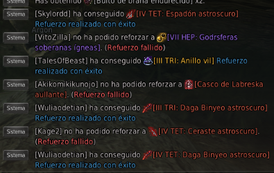
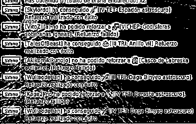

# BDO Loot Tracker - Contador de Botín para Black Desert Online

Este proyecto es una herramienta de superposición (overlay) para el juego Black Desert Online que rastrea automáticamente el botín obtenido y el tiempo de juego durante las sesiones de "grindeo". Utiliza captura de pantalla y reconocimiento óptico de caracteres (OCR) para leer el chat del juego y muestra un resumen en tiempo real en una interfaz personalizable.

Solo rastrea para la zona de Fogans

## Características Principales

- **Overlay en Tiempo Real:** Muestra una ventana superpuesta no intrusiva y personalizable sobre el juego.
- **Conteo Automático:** Detecta y cuenta automáticamente múltiples tipos de objetos y calcula el valor total en platas.
- **Temporizador de Sesión:** Registra el tiempo transcurrido desde que se inicia el contador.
- **Interfaz Personalizable:** El front-end está construido con React y CSS, permitiendo una personalización total del diseño.
- **Arquitectura Cliente-Servidor:** Un back-end robusto en Python se encarga del procesamiento pesado, mientras que un front-end ligero en Electron/React muestra los datos.

##  ¿Cómo Funciona?

El sistema se compone de dos programas que se comunican en tiempo real:

1.  **Back-end (Python):** Un script que se ejecuta en segundo plano y realiza las siguientes tareas:
    - **Captura de Pantalla:** Usando `mss`, captura continuamente una región específica de la pantalla donde aparece el chat de botín.

      

    - **Procesamiento de Imagen:** La imagen capturada se procesa con `OpenCV` para convertirla a blanco y negro y aplicarle filtros. Esto aísla el texto del fondo semitransparente del juego y maximiza la precisión del OCR.

      

    - **Reconocimiento de Texto (OCR):** Utiliza `Tesseract` para extraer el texto de la imagen procesada.
    - **Lógica de Conteo:** Una lógica personalizada en Python detecta las líneas nuevas de botín y actualiza los contadores.
    - **Servidor WebSocket:** A través de `Flask-SocketIO`, envía los datos actualizados (tiempo, conteo de botín, platas) al front-end cada vez que se detecta un cambio.

2.  **Front-end (Electron/React):** Es la aplicación de overlay visible.
    - **Ventana Transparente:** Electron crea una ventana sin bordes, transparente y siempre visible que no interfiere con los clics del juego.
    - **Interfaz de Usuario:** React renderiza la interfaz, mostrando los datos recibidos desde el back-end.
    - **Cliente WebSocket:** Se conecta al servidor de Python para recibir actualizaciones de datos en tiempo real.

## Prerrequisitos

Asegúrate de tener el siguiente software instalado:

- **Python 3.8+**
- **Node.js y npm**
- **Tesseract OCR Engine:** Descárgalo desde [UB-Mannheim/tesseract/wiki](https://github.com/UB-Mannheim/tesseract/wiki). Es crucial que la ruta de instalación esté correctamente configurada en el script de Python.

##  Instalación y Configuración

1.  **Clona el repositorio:**
    ```bash
    git clone [https://github.com/RenckLord/CaptureWithTesseractOCRforBDO.git](https://github.com/RenckLord/CaptureWithTesseractOCRforBDO.git)
    cd CaptureWithTesseractOCRforBDO
    ```

2.  **Configura el Back-end (Python):**
    ```bash
    cd backend
    python -m venv .venv
    .\.venv\Scripts\Activate.ps1
    pip install -r requirements.txt 
    ```
    *(Nota: Para crear el archivo `requirements.txt`, ejecuta `pip freeze > requirements.txt` después de instalar todas las librerías).*

3.  **Configura el Front-end (React):**
    ```bash
    cd ../frontend
    npm install
    ```

## ▶️ Ejecución

Para ejecutar la aplicación, necesitas tener dos terminales abiertas:

1.  **Terminal 1 (Iniciar el Back-end):**
    ```bash
    cd backend
    .\.venv\Scripts\Activate.ps1
    python bdo_counter_server.py
    ```

2.  **Terminal 2 (Iniciar el Front-end):**
    ```bash
    cd frontend
    npm start
    ```

El overlay aparecerá en tu pantalla y se actualizará automáticamente a medida que obtengas botín en el juego.

